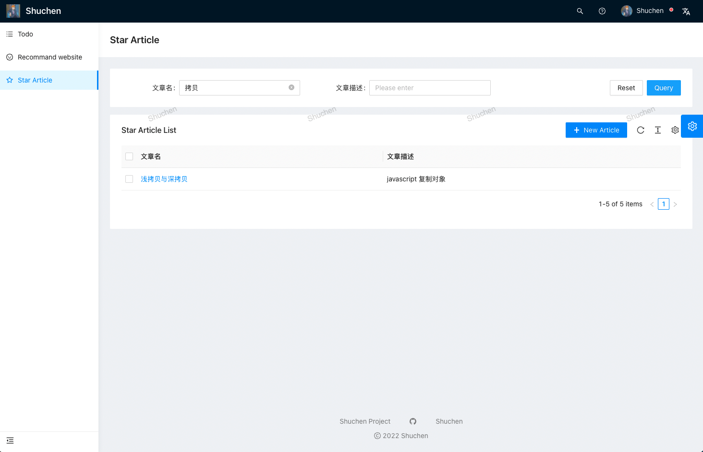

# 项目简介
基于 Ant Design Pro 进行项目初始化。实现用户登录校验、待办清单、文章收藏及检索、推荐网页展示等功能。前端部分利用 Mock 数据进行请求模拟，完成项目本地展示。后端使用 Express 框架进行搭建，与 MySQL 数据库进行交互，完成数据的基本增删改查。

# 项目演示

## 待办清单
实现待办清单的展示，能够添加代办并更改待办状态，并且未完成的待办将会在右侧头像处显示红点，在头像下拉清单中展示其数量。
[todo](./assets/1.png)

## 推荐网页
实现常用网站界面的展示，能够显示及互动点赞数量，通过分享链接展示目标页面。
[recommend](./assets/2.png)

## 收藏文章
实现个人收藏文章的录入、删除以及检索功能。通过文章名链接跳转目标文章页。

